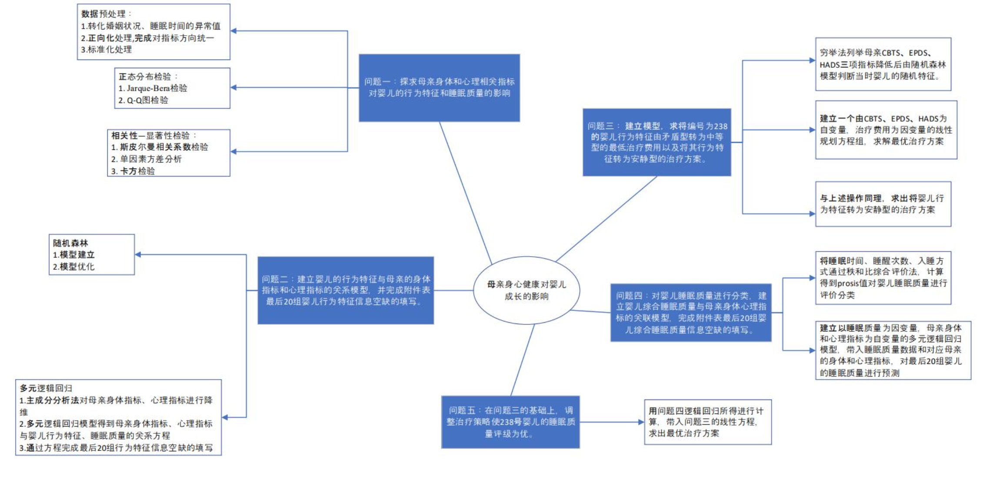
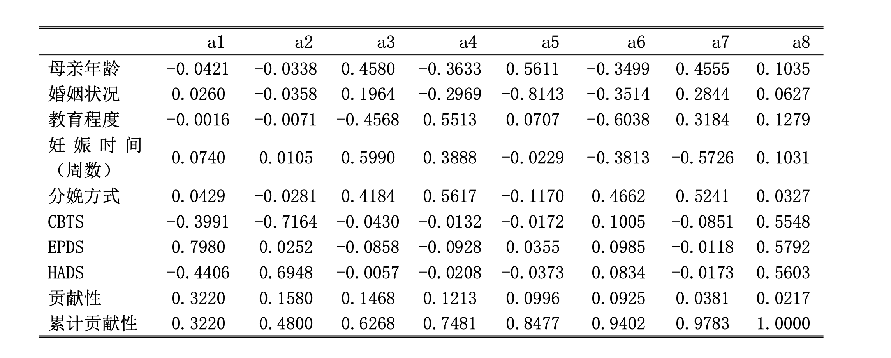
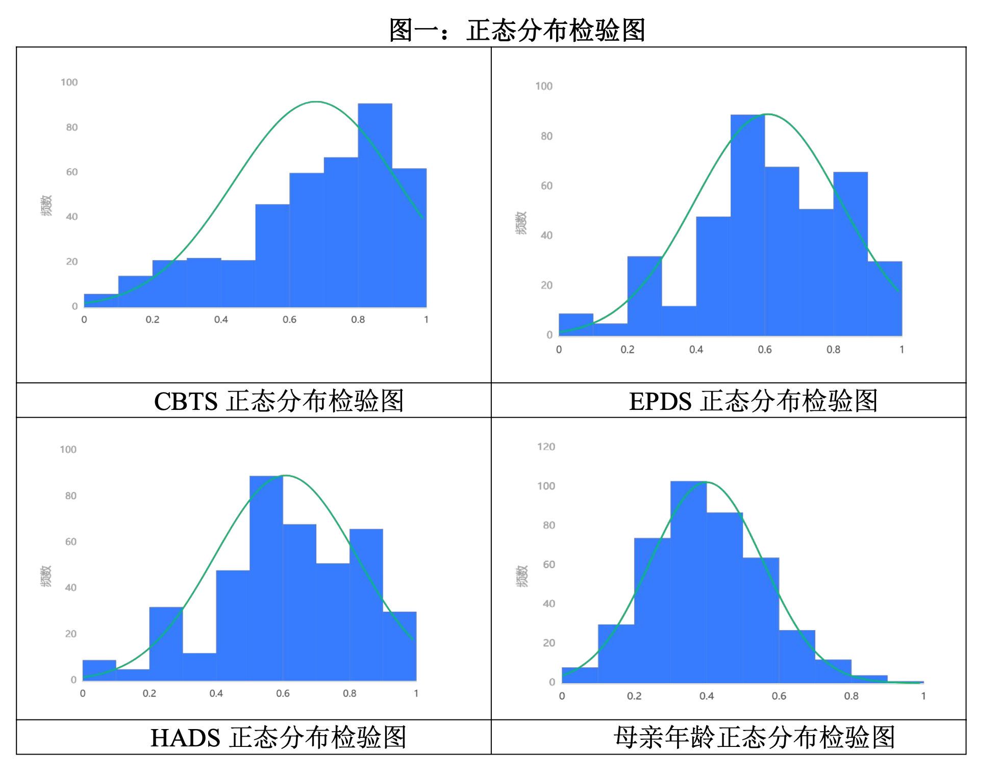

# 👶 Predictive Modeling of Baby & Maternity Health Impacts on Infant Growth  

**A statistical and machine learning framework for predicting infant behavioral and sleep outcomes based on maternal health indicators**  

<!-- Banner -->
<div align="center">
  
</div>

<!-- Badges -->
<div align="center">
  
  
  
</div>

---

## 📜 Overview  

This project explores how mothers’ **physical** and **psychological** health affect the **behavioral** and **sleep patterns** of their infants. Leveraging real survey data from **390 mother–infant pairs**, we integrate **statistical analysis**, **machine learning**, and **optimization modeling** to predict infant outcomes and design **cost-effective intervention strategies**.  

> 🏆 **Award:** Meritorious Award — *2023 Huashu Cup National Undergraduate Mathematical Modeling Competition*  

**Core Goals:**  
- 📊 Quantify correlations between maternal health metrics and infant development outcomes.  
- 🧠 Develop predictive models for infant behavior and sleep quality.  
- 💰 Optimize intervention strategies under cost constraints.  

---

## 📦 Installation  

**Requirements:**  
```bash
MATLAB R2022b or later
Excel / CSV dataset files
```

---

## 🔬 Methodology  

### 1️⃣ Data Preprocessing  
- Removed incomplete or missing entries and standardized categorical variables.  
- Replaced outliers for sleep time and marital status.  
- Unified indicator direction (positive vs. negative) and applied **Min–Max normalization**.  
- Encoded categorical features for compatibility with machine learning models.  

### 2️⃣ Statistical Analysis  
- Conducted normality testing using **Jarque–Bera** and **Q–Q plots**.  
- Performed correlation and significance testing with **Spearman**, **Chi-square**, and **ANOVA** to identify key predictors.  

### 3️⃣ Predictive Modeling  
- **Behavior Prediction**:  
  - Balanced class distribution using under-sampling and over-sampling techniques.  
  - Random Forest model (100 trees) baseline → **54% accuracy**.  
  - Applied PCA to reduce 8 behavioral indicators to 5 principal components (84.7% cumulative variance explained).  
  - Multinomial Logistic Regression achieved **70.3% accuracy** for behavior type classification.  
- **Sleep Quality Prediction**:  
  - Applied RSR (Rank-Sum Ratio) method to score sleep quality.  
  - Logistic Regression model achieved **75.6% accuracy** in multi-class classification.  

### 4️⃣ Optimization Model  
- Modeled treatment cost as:  
  \[
  \text{Cost} = a \cdot \Delta\text{CBTS} + b \cdot \Delta\text{EPDS} + c \cdot \Delta\text{HADS}
  \]
- Used exhaustive search over **6,992** possible score-reduction combinations.  
- Generated minimal-cost intervention plans that achieve both **behavior improvement** and **sleep quality enhancement**.  

---

## 📈 Key Results  

- **Psychological indicators** (CBTS, EPDS, HADS) have a stronger effect on infant sleep quality than physical indicators.  
- For **Case #238**, improving behavior from conflict-type to moderate-type requires a cost of **¥3,085**.  
- Joint optimization for both behavior improvement and sleep enhancement requires **tailored score-reduction strategies** for each case.  

---

## 📊 Results Visualization  

<p align="center">
  
  
</p>

---

## 🧱 Project Structure  

```bash
├── data/                      # Survey datasets (Excel/CSV)
├── preprocessing/              # Data cleaning and normalization scripts
├── statistical_analysis/       # Correlation and ANOVA analysis
├── modeling/                   # Machine learning models (RF, Logistic Regression, PCA)
├── optimization/               # Treatment cost optimization model
├── results/                    # Plots and figures
├── LICENSE
├── README.md

